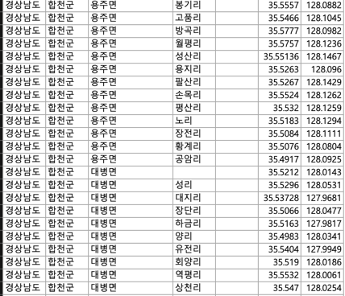

# 🛒 [땅땅땅] 우리동네 경매서비스

> 땅땅땅 서비스에서 지명의 DB화, 이웃 동네 찾는 로직이 있는 프로젝트입니다.


---
## 👫🏼 Team
|||||
|:-:|:-:|:-----------------------------------------------------------------------------------------:|:-:|
|[@beginninggrace](https://github.com/beginninggrace)<br/>|[@kimpangya](https://github.com/kimpangya)|           구동현<br/>[@kudongku](https://github.com/kudongku)                      |boy who loves potato<br/>[@potatobboi](https://github.com/potatobboi)|

---
## 🍀 ERD


---
## 🥊 구현과정

1. Set Up
   - 의존성 설치
       ```Gradle
        dependencies {
            ...
    
            //POI
            implementation 'org.apache.poi:poi:5.2.3'
            implementation group: 'org.apache.poi', name: 'poi-ooxml', version: '5.2.4'
        }
        ```
   - 엑셀파일 준비
    

2. 행정구역을 DB화
   - POI로 엑셀파일 읽기
   - 엔티티로 생성하는 테스트 코드 작성
3. Town과 이웃마을 DB화
   - 행정구역의 위도와 경도를 가지고 두 점 사이의 거리를 구하는 공식을 통해, 5km이내의 마을은 이웃 리스트에 추가합니다.
   - 그 서비스 코드를 실행시키는 테스트코드를 작성합니다.

