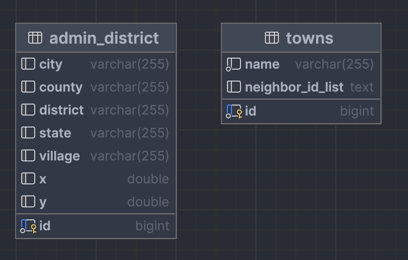

# 🛒 [땅땅땅] 우리동네 경매서비스

> 땅땅땅 서비스에서 지명의 DB화, 이웃 동네 찾는 로직이 있는 프로젝트입니다.


---
# 👫🏼 Team
|||||
|:-:|:-:|:-----------------------------------------------------------------------------------------:|:-:|
|[@beginninggrace](https://github.com/beginninggrace)<br/>|[@kimpangya](https://github.com/kimpangya)|           구동현<br/>[@kudongku](https://github.com/kudongku)                      |boy who loves potato<br/>[@potatobboi](https://github.com/potatobboi)|

---
# 🍀 ERD



---
# 구현과정
- 행정구역 DB화
- 이웃동네 List를 Column으로 가지는 동네 Entity 생성

순서로 이어집니다.

---

## 행정구역 DB화
### 의존성 생성하기
```gradle
dependencies {
    implementation 'org.springframework.boot:spring-boot-starter-data-jpa'
    compileOnly 'org.projectlombok:lombok'
    runtimeOnly 'com.mysql:mysql-connector-j'
    ...

    //POI
    implementation 'org.apache.poi:poi:5.2.3'
    implementation group: 'org.apache.poi', name: 'poi-ooxml', version: '5.2.4'
}
```
---
## 엑셀 파일 준비

이러한 엑셀 파일을 src/main/resources에 준비해줍니다.

---

## Entity와 Repository
```java
@Getter
@NoArgsConstructor
@AllArgsConstructor
@Entity
@Table(name = "admin_district")
public class AdminDistrict {

    @Id
    @GeneratedValue(strategy = GenerationType.IDENTITY)
    private Long id;

    @Column
    private String state;

    @Column
    private String county;

    @Column
    private String city;

    @Column
    private String district;

    @Column
    private String village;

    @Column
    private Double x;

    @Column
    private Double y;

    public AdminDistrict(
        String state,
        String county,
        String city,
        String district,
        String village,
        Double x,
        Double y
    ) {
        this.state = state;
        this.county = county;
        this.city = city;
        this.district = district;
        this.village = village;
        this.x = x;
        this.y = y;
    }

}
```
AdminDistrict(행정구역)이라는 Entity를 생성했습니다.

Column들의 이름은 미국 행정구역에서 따왔는데요,
아무래도 한국 행정구역의 이름을 따오면 Do, Si이런식이라 예약어에 걸리기도 하고, 직관성을 가져오기 위해서 미국 행정구역을 따왔습니다.

위도와 경도는 x,y로 결정합니다.

---

## Service 생성
```java
@Slf4j(topic = "AdminDistrictService")
@RequiredArgsConstructor
@Transactional(readOnly = true)
@Service
public class AdminDistrictService {

    private final static String excelDirectory = "src/main/resources/AdminDistrictExcel.xlsx";

    private final AdminDistrictRepository adminDistrictRepository;

    @Transactional
    public void createAdminDistrict() {

        try (FileInputStream file = new FileInputStream(excelDirectory)) {

            List<AdminDistrict> townList = new ArrayList<>();
            Workbook workbook = WorkbookFactory.create(file);
            int sheets = workbook.getNumberOfSheets();

            for (int i = 0; i < sheets; i++) {
                Sheet sheet = workbook.getSheetAt(i);

                for (int j = 1; j < sheet.getPhysicalNumberOfRows(); j++) {
                    Row row = sheet.getRow(j);

                    townList.add(new AdminDistrict(
                        row.getCell(0).getStringCellValue(),
                        row.getCell(1).getStringCellValue(),
                        row.getCell(2).getStringCellValue(),
                        row.getCell(3).getStringCellValue(),
                        row.getCell(4).getStringCellValue(),
                        row.getCell(5).getNumericCellValue(),
                        row.getCell(6).getNumericCellValue()
                    ));
                }

            }

            adminDistrictRepository.saveAll(townList);

        } catch (IOException | EncryptedDocumentException e) {
            log.error(e.getMessage());
        }

    }

}
```
Apache POI를 통해 엑셀 파일을 읽어오는 과정입니다.

### FileInputStream file = new FileInputStream(excelDirectory)
엑셀 파일을 디렉토리주소를 통해 가져오는 과정입니다.

### Workbook workbook = WorkbookFactory.create(file)
가져온 file을 WorkbookFactory를 통해 workbook으로 생성합니다.

### Sheet sheet = workbook.getSheetAt(i);
제가 준비한 엑셀파일에는 sheet로 경기도, 강원도, 경상남도,,, 식으로 분리가 되어있어서 일단 sheet별로 순회합니다.

### Row row = sheet.getRow(j);
sheet안에 있는 Row를 순회하면서 값들을 통해 엔티티를 생성해줍니다. 생성한 엔티티를 db에 넣어줍니다.

---

이런 메소드를 실행시켜주기 위해서 테스트 코드가 필요합니다.

```java
@SpringBootTest
class CityDbDdangApplicationTests {

    @Autowired
    AdminDistrictService adminDistrictService;

    @Test
    @Rollback(false)
    @DisplayName("townList 엑셀 파일 DB에 저장")
    void saveTownListDB() {
        //given, when,then
        adminDistrictService.createAdminDistrict();
    }

}
```
DB에 저장하기 위한 용도이니, 
Rollback을 false로 지정해줍니다.

---
## 테스트 코드 실행하기

정상적으로 실행이 잘 되네요!

DB에도 값이 잘 들어간 것을 볼 수 있습니다.

---

## 이웃동네 List를 Column으로 가지는 동네 Entity 생성
## Entity와 Repository 생성
```java
@Getter
@NoArgsConstructor
@AllArgsConstructor
@Entity
@Table(name = "towns")
public class Town {

    @Id
    @GeneratedValue(strategy = GenerationType.IDENTITY)
    private Long id;

    @Column(nullable = false)
    private String name;

    @Column(columnDefinition = "TEXT")
    private String neighborIdList;

    public Town(String name, String idList) {
        this.name = name;
        this.neighborIdList = idList;
    }

}
```
Town 엔티티의 neighborIdList은 string값으로 있습니다. 이유는 ```List<Long>```타입을 Column에 넣기 위해 objectMapper로 String으로 바꿔줄 계획입니다.

---

## Service 생성
```java
@RequiredArgsConstructor
@Service
public class TownService {

    private final static Double DEFAULT_X = 111.35;
    private final static Double DEFAULT_Y = 88.80;
    private final static Double DEFAULT_DISTANCE = 5.0;
    private final TownRepository townRepository;
    private final AdminDistrictRepository adminDistrictRepository;
    private final ObjectMapper objectMapper;

    @Transactional
    public void createTown() throws JsonProcessingException {
        List<AdminDistrict> adminDistricts = adminDistrictRepository.findAll();

        for (AdminDistrict adminDistrict : adminDistricts) {
            List<Long> idList = new ArrayList<>();
            String name = getTownName(adminDistrict);

            for (AdminDistrict comparison : adminDistricts) {
                double x = Math.pow((adminDistrict.getX() - comparison.getX()) * DEFAULT_X, 2.0);
                double y = Math.pow((adminDistrict.getY() - comparison.getY()) * DEFAULT_Y, 2.0);

                double distance = Math.sqrt(x + y);

                if (distance < DEFAULT_DISTANCE) {
                    idList.add(comparison.getId());
                }
            }

            String neighborIdList = objectMapper.writeValueAsString(idList);
            Town town = new Town(name, neighborIdList);
            townRepository.save(town);
        }
    }

    public String getTownName(AdminDistrict adminDistrict) {
        StringBuilder name = new StringBuilder(adminDistrict.getState());

        if (!adminDistrict.getCounty().isEmpty()) {
            name.append(" ").append(adminDistrict.getCounty());
        }

        if (!adminDistrict.getCity().isEmpty()) {
            name.append(" ").append(adminDistrict.getCity());
        }

        if (!adminDistrict.getDistrict().isEmpty()) {
            name.append(" ").append(adminDistrict.getDistrict());
        }

        if (!adminDistrict.getVillage().isEmpty()) {
            name.append(" ").append(adminDistrict.getVillage());
        }

        return String.valueOf(name);
    }

}
```

### createTown
메소드는 생각보다 간단합니다.

```List<AdminDistrict> adminDistricts = adminDistrictRepository.findAll```를 통해 모든 행정구역 entity를 가져오고 하나씩 순회합니다.

한 엔티티를 가지고 나머지 엔티티를 하나씩 비교해가며 두점사이의 거리가 5km 이하일때만, neighborList에 넣어줍니다.

순회가 끝나면 objectMapper.writeValueAsString을 통해 String 값으로 변경한 다음 Entity로 생성해서 레포지토리에 넣어줍니다.

### getTownName
StringBuilder를 통해 경기도 + 하남시 + 덕풍북로 이렇게 column값들을 더해주며 Town의 Name Column을 완성합니다.

---

## Test
```java
    @Test
    @Rollback(false)
    @DisplayName("town DB에 저장")
    void saveTownDB() throws JsonProcessingException {
        //given, when, then
        townService.createTown();
    }
```
이전 게시물과 마찬가지로, 테스트 코드로 실행해주면 됩니다.
다만 이전 게시물의 테스트코드를 실행시키고 지금 테스트 코드를 실행시켜주어야 합니다.

```java
@TestMethodOrder(MethodOrderer.OrderAnnotation.class)
@SpringBootTest
class CityDbDdangApplicationTests {

    @Autowired
    TownService townService;

    @Autowired
    AdminDistrictService adminDistrictService;

    @Test
    @Order(1)
    @Rollback(false)
    @DisplayName("townList 엑셀 파일 DB에 저장")
    void saveTownListDB() {
        //given, when,then
        adminDistrictService.createAdminDistrict();
    }

    @Test
    @Order(2)
    @Rollback(false)
    @DisplayName("town DB에 저장")
    void saveTownDB() throws JsonProcessingException {
        //given, when, then
        townService.createTown();
    }

}
```
이 문제는 TestMethodOrder 어노테이션으로 해결할 수 있었습니다.

테스트코드가 정상적으로 돌아갑니다.

DB에도 값이 잘 들어가네요.

---

> 이렇게 완성한 Entity를 통해 사용자의 town.neighbor_id_list를 objectMapper로 읽어와서
List로 변환한 다음에, 그 리스트에 해당하는 경매글을 조회하여야 할까요? 답은 아닙니다. objectMapper를 매번 생성하면 리소스 낭비가 심하기 때문에, Column의 type을 String에서 json으로 변경해주겠습니다.

터미널 명령어를 해도 좋고, 인텔리제이에서 하셔도 좋습니다.
저는 편의성을 위해 인텔리제이에서 하겠습니다.

### 1. tables>towns>modify table


### 2. column> data type 변경
변경 전,

변경 후,


이제는 town엔티티의 이웃 동네 list를 조회할때,
objectMapper를 사용하지 않아도 됩니다.

